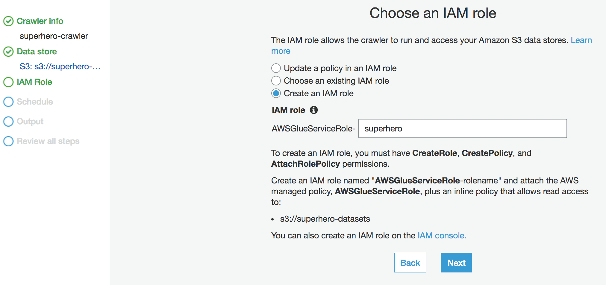
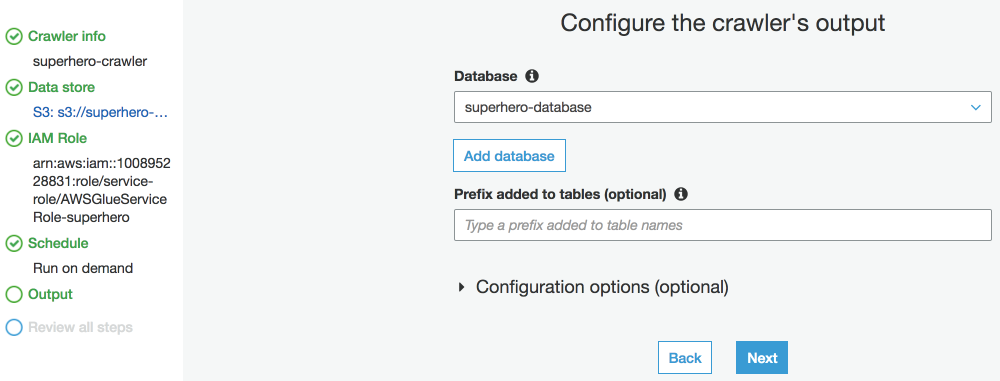
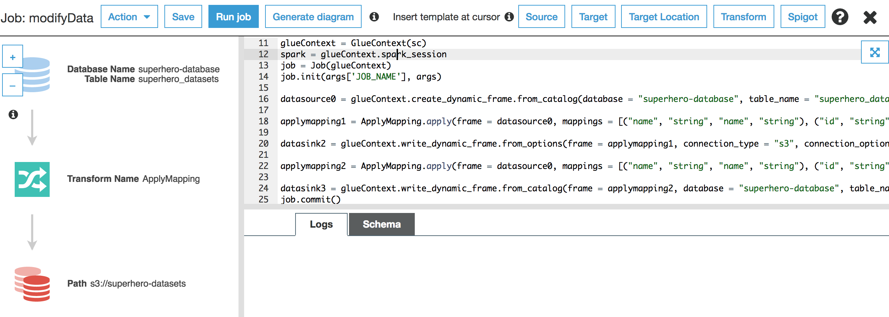
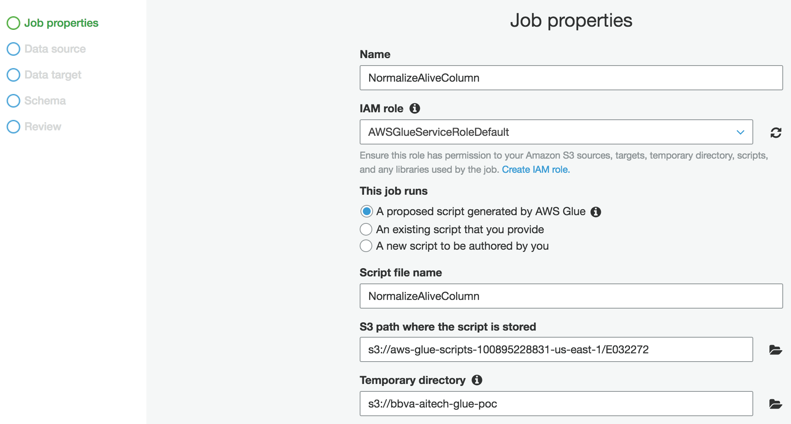

# ETL sobre AWS


A la hora de realizar un Pipeline de ETL dentro de la plataforma AWS, se han utilizado los siguientes servicios:

- **S3**: Servicio de almacenamiento de objetos, nos servirá para alojar los datasets de entrada y para almacenar los resultados de la ejecución.

- **AWS Glue**: Servicio de extracción, transformación y carga (ETL) que facilita la preparación y carga de los datos para su análisis.

- **Athena**: Servicio para realizar consultas de datos para análisis desde ficheros almacenados en S3.

- **Quicksight**: Servicio para crear paneles de visualización para generar informes.

## Contenido

Para la reproducción completa del experimento se han realizado una serie de pasos sobre cada servicio:

- [S3](S3)
- [AWS Glue](AWS-Glue)
- [Athena](Athena)
- [Quicksight](Quicksight)

### S3

  - Se han utilizado dos datasets que contienen información sobre los superheroes de Marvel y los de DC. Se han descargado de este [repositorio](https://github.com/fivethirtyeight/data/tree/master/comic-characters), cuyos responsables se han preocupado de obtenerlos previamente de [DC Wikia](http://dc.wikia.com/wiki/Main_Page) y [Marvel Wikia](http://marvel.wikia.com/wiki/Main_Page).

    Puedes descargar los datasets desde los siguientes enlaces:

    - Dataset de DC Wikia, documento [dc-wikia-data.csv](data/dc-wikia-data.csv).
    - Dataset de Marvel Wikia, documento [marvel-wikia-data.csv](data/marvel-wikia-data.csv).

  - La importación de los mismos se ha realizado sobre S3, mediante un upload de ambos ficheros a un Bucket (superhero-datasets) creado previamente, ambas acciones con las configuraciones por defecto, como se muestra en la siguiente imagen:

  

### AWS Glue

Las ejecuciones de Glue han sido divididas en diferentes partes contenidas en el propio servicio:

#### Crawler

  - Lo primero que haremos será crearnos un crawler, es decir, un rastreador que se conecta a un almacén de datos (S3), avanzando a través de una lista priorizada de clasificadores para determinar el esquema de dichos datos, y creando tablas de metadatos en el catálogo de datos.
  

  - A continuación utilizaremos los siguientes datos de conexión:

    - Crawler name: superhero-crawler
    
    - Data store: S3, Crawl data in "Specified path in my account", Include path "s3://superhero-datasets"
    
    - Add another data store: No
    - Create an IAM role: AWSGlueServiceRole-superhero
    
    - Frequency: run on demand
    - Configure the crawler's output: add a new database named superhero-database
    
    - Finish!

  - Una vez creado el crawler, lo siguiente es ejecutarlo, para ello lo seleccionamos y pulsamos el botón "Run crawler".

  - Pasado un tiempo, una vez el estado del crawler este en estado "Ready", podemos ir a revisar la base de datos generada por el crawler y que se ha incorporado al "Catálogo" de Glue.

#### Database

  - Para ver la nueva tabla que hemos creado a partir de los dos Datasets, pulsamos en el link "Databases", ahí nos aparecerá nuestra nueva BD (si no es así pulsar el boton refresh arriba a la derecha).

  - Después generaremos otra nueva tabla para poder almacenar los datos filtrados que necesitaremos más adelante, los datos de columnas a crear serán estos:
  name (String), id (String), align (String), eye (String), hair (String), sex (String), alive (Boolean), appearances (int), year (String), page_id (String), urlslug (String), gsm (String), first_appearance (String); y finalizamos.

  - Lo siguiente que haremos será eliminar unas columnas que no son necesarias para el desarrollo de la prueba, estas son: page_id, urlslug, GSM, FIRST_APPEARANCE y la columna duplicada "year" (la última), que borraremos accediendo a la tabla y pulsando el botón "edit schema", a continuación pulsando en el botón "x" de cada columna a eliminar. También cambiaremos el tipo de la columna "alive" a boolean.

#### Job

  - En este punto vamos a crear un job para realizar normalizaciones y crear una nueva tabla en el catalogo:

      - Primero, vamos a ordenar las columnas para poder dejar al final las columnas que no nos sirven y poder eliminarlas (Glue no permite borrado selectivos de columnas, sino que elimina a partir de la ultima):

      - Creamos un nuevo job, con nombre "transformer", con el rol anteriormente utilizado, la opción "A proposed script generated by AWS Glue" de como se ejecutará el batch, el directorio donde almacenaremos el script y el directorio temporal de trabajo, y pulsamos siguiente. Como datasource seleccionamos la tabla del catalogo generada previamente, y como dat target, generemos una nueva tabla con S3 como Data Store, formato CSV, sin compresión y poniendo la ruta donde queremos que se genere el CSV. A continuación tenemos que mapear las columnas origen a unas columnas destino, para ello vamos a desplazar los siguientes tipos al final de la lista, en este orden: page_id, urlslug, gsm, first_appearance, para en una siguiente iteración poder eliminarlos, y para terminar pulsamos en "finish".

      - Nos aparecerá la pantalla de configuración, edición y ejecución del job. Lo primero que haremos será eliminar el código existente y copiar el siguiente:

      ```python
      import sys
      from awsglue.transforms import *
      from awsglue.utils import getResolvedOptions
      from pyspark.context import SparkContext
      from awsglue.context import GlueContext
      from awsglue.job import Job

      args = getResolvedOptions(sys.argv, ['JOB_NAME'])

      sc = SparkContext()
      glueContext = GlueContext(sc)
      spark = glueContext.spark_session
      job = Job(glueContext)
      job.init(args['JOB_NAME'], args)

      datasource0 = glueContext.create_dynamic_frame.from_catalog(database = "superhero-database", table_name = "superhero_datasets")

      def changeType(data):
          if "iving" in data["alive"]:
              data["alive"] = True
          elif "eceased" in data["alive"]:
              data["alive"] = False

          if data["appearances"] is None:
              data["appearances"] = 0

          return data

      mapped_dyF =  Map.apply(frame = datasource0, f = changeType)

      applymapping2 = ApplyMapping.apply(frame = mapped_dyF, mappings = [("name", "string", "name", "string"), ("id", "string", "id", "string"), ("align", "string", "align", "string"), ("eye", "string", "eye", "string"), ("hair", "string", "hair", "string"), ("sex", "string", "sex", "string"), ("alive", "string", "alive", "string"), ("appearances", "string", "appearances", "string"), ("year", "string", "year", "string"), ("page_id", "long", "page_id", "long"), ("urlslug", "string", "urlslug", "string"), ("gsm", "string", "gsm", "string"), ("first_appearance", "string", "first_appearance", "string")], transformation_ctx = "applymapping1")

      datasink2 = glueContext.write_dynamic_frame.from_catalog(frame = applymapping2, database = "superhero-data", table_name = "superhero", transformation_ctx = "datasink2")

      job.commit()
      ```

      - Después guardamos y ejecutamos el job.
      

      - Ahora ya disponemos de una tabla con los datos ordenados listos para poder eliminar las columnas no necesarias para la PoC, estas son: page_id, urlslug, gsm, first_appearance

      - Ya tenemos nuestra tabla limpia, lo siguiente será normalizar la columna Alive, para ello empezamos a crear el job normalizeAlive, introduciendo el nombre, el IAM Role que elegimos anteriormente, la opción "A proposed script generated by AWS Glue" de como se ejecutará el batch, el directorio donde almacenaremos el script y el directorio temporal de trabajo, y pulsamos siguiente.
      

      - A continuación seleccionamos el dataset que hemos estado utilizado, "superhero-filter" de la "superhero-database" y pulsamos siguiente.

      - Como data target seleccionamos el directorio de S3 donde estamos almacenando todo.

      - En el siguiente apartado, edición del esquema, cambiaremos el tipo de la columna "alive" a boolean y de la columna "appearances" a int y finalizamos.

### Athena

- Gracias al servicio de Athena hemos sido capaces de ir realizando queries sobre las tablas de catalogo generadas para ir verificando que los datos generados y fusionados cumplen (más o menos) con los criterios establecidos.

- Un ejemplo utilizado ha sido la query: **SELECT * FROM "superhero-data"."superhero" where name like '%Batman (Bruce Wayne)%';**, con la que hemos podido ver el registro del superheroe Batman.

- Otro ejemplo de consulta ha sido: **SELECT count(*) FROM "superhero-data"."superhero";**, con la que obtenemos el número de registros que hemos generado.

### Quicksight
