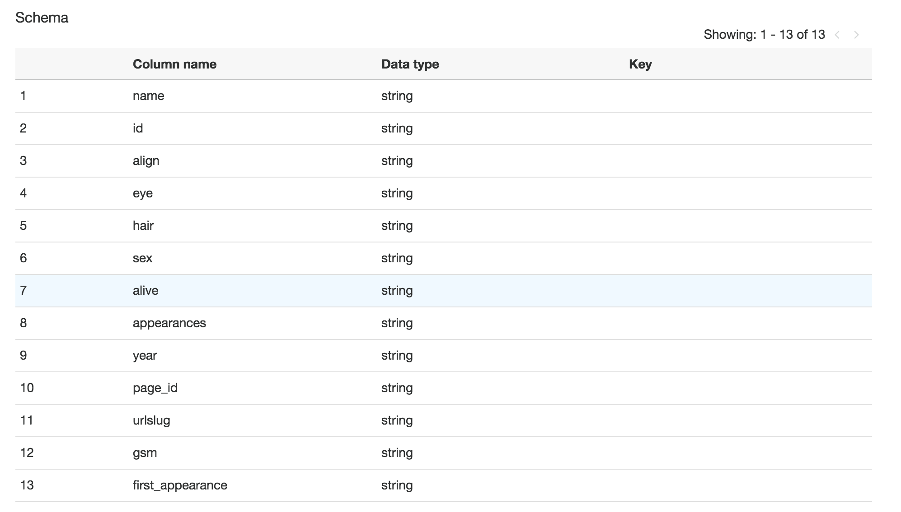
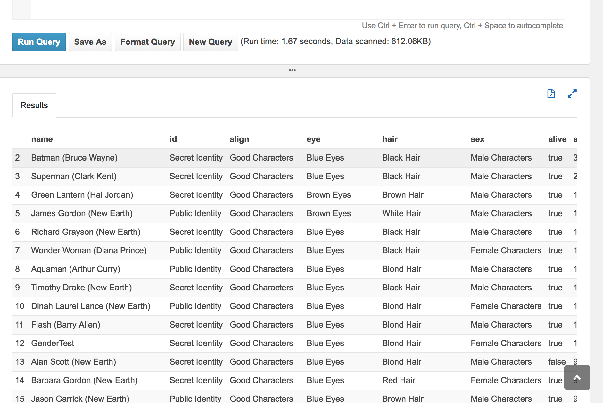
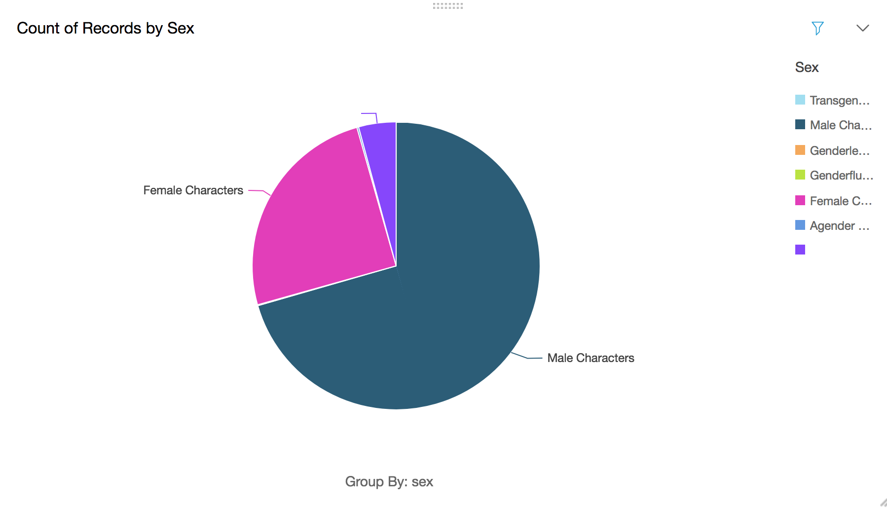
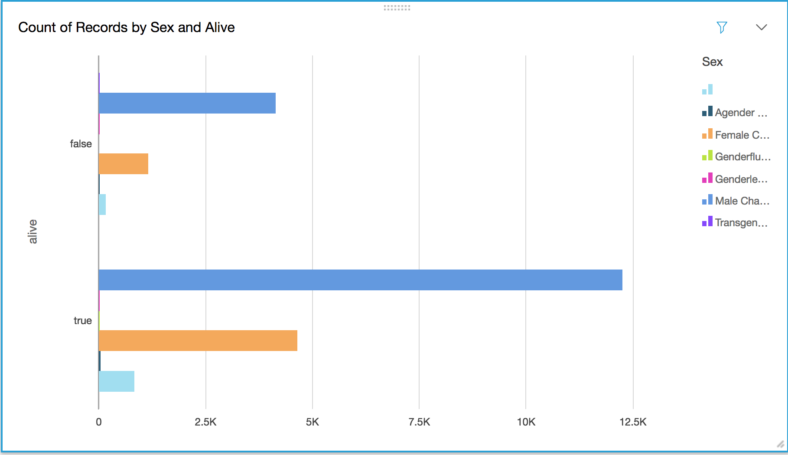

# ETL sobre AWS

A la hora de realizar un Pipeline de ETL dentro de la plataforma AWS, se han utilizado los siguientes servicios:

- **S3**: Servicio de almacenamiento de objetos, nos servirá para alojar los datasets de entrada y para almacenar los resultados de la ejecución.

- **AWS Glue**: Servicio de extracción, transformación y carga (ETL) que facilita la preparación y carga de los datos para su análisis.

- **Athena**: Servicio para realizar consultas de datos para análisis desde ficheros almacenados en S3.

- **Quicksight**: Servicio para crear paneles de visualización para generar informes.

## Contenido

Para la reproducción completa del experimento se han realizado una serie de pasos sobre cada servicio:

* [S3](#s3)
* [AWS Glue](#aws-glue)
* [Athena](#athena)
* [Quicksight](#quicksight)

## S3

  - Se han utilizado dos datasets que contienen información sobre los superheroes de Marvel y los de DC. Se han descargado de este [repositorio](https://github.com/fivethirtyeight/data/tree/master/comic-characters), cuyos responsables se han preocupado de obtenerlos previamente de [DC Wikia](http://dc.wikia.com/wiki/Main_Page) y [Marvel Wikia](http://marvel.wikia.com/wiki/Main_Page).

    Puedes descargar los datasets desde los siguientes enlaces:

    - Dataset de DC Wikia, documento [dc-wikia-data.csv](data/dc-wikia-data.csv).
    - Dataset de Marvel Wikia, documento [marvel-wikia-data.csv](data/marvel-wikia-data.csv).

  - La importación de los mismos se ha realizado sobre S3, mediante un upload de ambos ficheros a un Bucket (superhero-datasets) creado previamente, ambas acciones con las configuraciones por defecto, como se muestra en la siguiente imagen:

  

## AWS Glue

Las ejecuciones de Glue han sido divididas en diferentes partes contenidas en el propio servicio:

### Crawler

  - Lo primero que haremos será crearnos un crawler, es decir, un rastreador que se conecta a un almacén de datos (S3), avanzando a través de una lista priorizada de clasificadores para determinar el esquema de dichos datos, y creando tablas de metadatos en el catálogo de datos.
  

  - A continuación utilizaremos los siguientes datos de conexión:

    - Crawler name: superhero-crawler
    
    - Data store: S3, Crawl data in "Specified path in my account", Include path "s3://superhero-datasets"
    
    - Add another data store: No
    - Create an IAM role: AWSGlueServiceRole-superhero
    
    - Frequency: run on demand
    - Configure the crawler's output: add a new database named superhero-database
    
    - Finish!

  - Una vez creado el crawler, lo siguiente es ejecutarlo, para ello lo seleccionamos y pulsamos el botón "Run crawler".

  - Pasado un tiempo, una vez el estado del crawler este en estado "Ready", podemos ir a revisar la base de datos generada por el crawler y que se ha incorporado al "Catálogo" de Glue.

### Database

  - Para ver la nueva tabla que hemos creado a partir de los dos Datasets, pulsamos en el link "Databases", ahí nos aparecerá nuestra nueva BD (si no es así pulsar el boton refresh arriba a la derecha).

  - Después generaremos otra nueva tabla para poder almacenar los datos filtrados que necesitaremos más adelante, los datos de columnas a crear serán estos:
  name (String), id (String), align (String), eye (String), hair (String), sex (String), alive (Boolean), appearances (int), year (String), page_id (String), urlslug (String), gsm (String), first_appearance (String); y finalizamos.
  

### Job

  - En este punto vamos a crear un job para realizar normalizaciones y crear una nueva tabla en el catalogo:

      - Primero, vamos a ordenar las columnas para poder dejar al final las columnas que no nos sirven y poder eliminarlas (Glue no permite borrado selectivos de columnas, sino que elimina a partir de la ultima), para ello creamos un nuevo job, con nombre "transformer", con el rol anteriormente utilizado, la opción "A proposed script generated by AWS Glue" de como se ejecutará el batch, el directorio donde almacenaremos el script y el directorio temporal de trabajo, y pulsamos siguiente. Como datasource seleccionamos la tabla del catalogo generada previamente, y como data target, la tabla manual creada en el paso anterior. A continuación tenemos que mapear las columnas origen a unas columnas destino, para ello vamos a desplazar los siguientes tipos al final de la lista, en este orden: page_id, urlslug, gsm, first_appearance (para en una siguiente iteración poder eliminarlos), y para terminar pulsamos en "finish".

      - Nos aparecerá la pantalla de configuración, edición y ejecución del job. Lo primero que haremos será eliminar el código existente y copiar el contenido en este fichero:

      

      - Después guardamos y ejecutamos el job.
      

      - Ya tenemos nuestra tabla con los datos ordenados y con la columna alive normalizada con los valores True o False.

## Athena

- Gracias al servicio de Athena hemos sido capaces de ir realizando queries sobre las tablas de catalogo generadas para ir verificando que los datos generados y fusionados cumplen (más o menos) con los criterios establecidos.

- Un ejemplo utilizado ha sido la query: **SELECT * FROM "superhero-data"."superhero" where name like '%Batman (Bruce Wayne)%';**, con la que hemos podido ver el registro del superheroe Batman.

- Otro ejemplo de consulta ha sido: **SELECT count(*) FROM "superhero-data"."superhero";**, con la que obtenemos el número de registros que hemos generado.

- Gracias a este servicio hemos podido encontrar "pegas" a Glue, y es que nos han salido muchos registros de manera diferente a como los esperabamos recibir...

## Quicksight

- Con este servicio vamos a generar las gráficas para poder visualizar nuestros datos. Debido a los problemas acontecidos anteriormente con los datos, gracias a este servicio vamos a poder realizar algunos filtros que facilitan el generar información tal y como esperabamos.

- Lo primero que haremos será pulsar el botón "Manage data" para después generar un nuevo dataset, seleccionando el link de "Athena", donde introduciremos el nombre del dataset, para a continuación crear el "data source". Aquí seleccionamos nuestra base de datos creada con Glue y la tabla destino de los datos (la creada manualmente). Para finalizar la creación seleccionamos la opción "Directly query your data" y pulsamos en "Visualize".

- Comprobamos como aparecen los campos de nuestra tabla, así como los diferentes gráficos que podemos utilizar y los filtros que podemos poner a nuestras consultas. Primero pulsamos en el desplegable con el nombre de nuestra tabla y seleccionamos la opción "Edit analysis data sets" y elegimos la opción "edit". Nos aparece una nueva pantalla donde vamos a deseleccionar los campos que no necesitamos: page_id, urlslug, gsm, first_appearance.

- Ahora vamos a añadir nuestro primer filtro para eliminar la primera fila que representa la cabecera (Glue no la elimina), para ello pulsamos en "new filter", seleccionamos el campo "name" y lo pulsamos, luego elegimos la opción "custom filter", elegimos "Does not equals" y escribimos name, y pulsamos Apply y luego "save & visualize".

- El siguiente filtro a crear será el del campo "alive", con tipo "custom filter list" y añadimos los valores true y false, con esto conseguimos eliminar todos los registros mal generados que no cumplen con estos dos valores.

- Ahora vamos a crear un dashboard de tipo "Pie Chart" y seleccionamos el campo "sex" y vemos nuestra primera gráfica que nos muesta el gráfico con la cantidad de los diferentes géneros dentro del dataset:

- Para finalizar creamos otro dashboard de tipo "Horizontal Bar Chart" y seleccionamos los campos "sex" y "alive", donde visualizamos el genero de los superheroes que están vivos y de los que están muertos:

