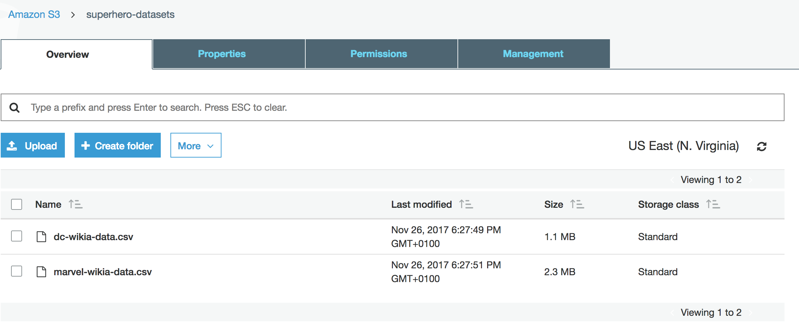
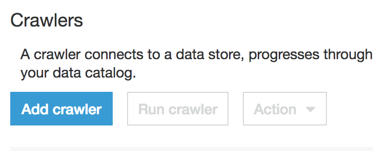
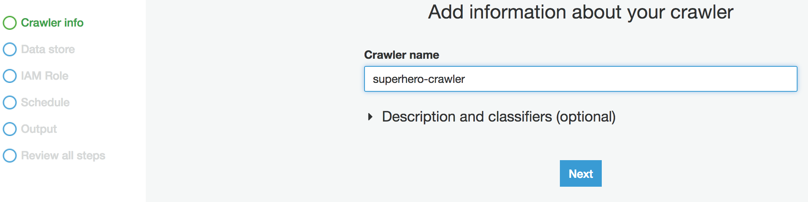
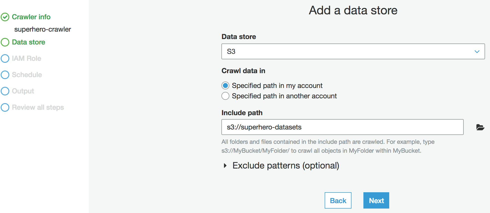

# ETL sobre AWS

A la hora de realizar un Pipeline de ETL dentro de la plataforma AWS, se han utilizado los siguientes servicios:

- S3: Servicio de almacenamiento de objetos, nos servirá para alojar los datasets de entrada y para almacenar los resultados de la ejecución.
- AWS Glue: Servicio de extracción, transformación y carga (ETL) que facilita la preparación y carga de los datos para su análisis.
- RDS: Servicio
- Quicksight

## Contenido

Para la reproducción completa del experimento se han realizado una serie de pasos sobre cada servicio:

- [S3](S3)
- [AWS Glue](AWS-Glue)
- [RDS](RDS)
- [Quicksight](Quicksight)

### S3

  - Se han utilizado dos datasets que contienen información sobre los superheroes de Marvel y los de DC. Se han descargado de este [repositorio](https://github.com/fivethirtyeight/data/tree/master/comic-characters), cuyos responsables se han preocupado de obtenerlos previamente de [DC Wikia](http://dc.wikia.com/wiki/Main_Page) y [Marvel Wikia](http://marvel.wikia.com/wiki/Main_Page).

    Puedes descargar los datasets desde los siguientes enlaces:

    - Dataset de DC Wikia, documento [dc-wikia-data.csv](data/dc-wikia-data.csv).
    - Dataset de Marvel Wikia, documento [marvel-wikia-data.csv](data/marvel-wikia-data.csv).

  - La importación de los mismos se ha realizado sobre S3, mediante un upload de ambos ficheros a un Bucket (superhero-datasets) creado previamente, ambas acciones con las configuraciones por defecto, como se muestra en la siguiente imagen:

  

### AWS Glue
  - Lo primero que haremos será crearnos un crawler, es decir, un rastreador que se conecta a un almacén de datos (S3), avanzando a través de una lista priorizada de clasificadores para determinar el esquema de dichos datos, y creando tablas de metadatos en el catálogo de datos.
  
  - A continuación utilizaremos los siguientes datos de conexión:
    - Nombre del crawler: superhero-crawler
    
    - Data store: S3, Crawl data in "Specified path in my account", Include path "s3://superhero-datasets"
    
    - Add another data store: No
    - Create an IAM role: AWSGlueServiceRole-superhero 

### RDS
  -

### Quicksight
  -
