# ETL sobre GCP

TBD

## Contenido

* [Creando el proyecto en GCP](#creando-el-proyecto-en-gcp)
* [Subiendo los datos de prueba](#subiendo-los-datos-de-prueba)
* [Trabajando el ETL](#trabajando-el-etl)
    * [Uniendo los datasets](#uniendo-los-datasets)
    * [Normalizando los datos](#normalizando-los-datos)
        * [Eliminando columnas innecesarias](#eliminando-columnas-innecesarias)
        * [Normalizando la columna ALIVE](#normalizando-la-columna-alive)
        * [Normalizando la columna APPEARANCES](#normalizando-la-columna-appearances)
    * [Exportando los datos](#exportando-los-datos)
        * [Preparando BigQuery](#preparando-bigquery)
        * [Creando el job de exportación](#creando-el-job-de-exportación)
* [Visualizando el resultado](#visualizando-el-resultado)

## Creando el proyecto en GCP

Lo primero que debemos hacer para trabajar esta POC es crear un nuevo proyecto Google Cloud Platform. Para ello, vamos al [site oficial](https://cloud.google.com/) e iniciamos sesión desde el botón **Sign in** que podemos encontrar en la parte superior derecha. Lo hacemos con nuestra cuenta de [Gmail](https://www.google.com/gmail/).

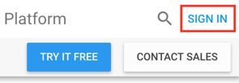

Una vez hecho, nos dirigimos a la consola de Google Cloud Platform haciendo clic sobre el botón **Console** que se ha dispuesto en la parte superior derecha tras el inicio de sesión.

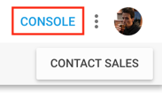

Ya en la consola, vamos a crear un nuevo proyecto. En la barra superior hay botón titulado **Select a project**; desde este botón se pueden crear nuevos proyectos o seleccionar uno de los ya existentes. Es posible que, por defecto, aparezca ya uno seleccionado; no hay de qué preocuparse, el clic sobre uno u otro te lleva a la misma ventana modal.

En esta ventana, clicamos en el botón correspondiente para crear un nuevo proyecto.

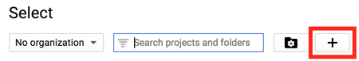

Lo siguiente es indicar un nombre para el proyecto en el campo **Project name**. Yo le he llamado **superheroes**, pero siéntete libre de elegir otro que te resulte más apropiado. Es importante prestar atención al campo **Project ID**: si el nombre propuesto para el proyecto ya está en uso, Google genera un texto aleatorio para usarlo como identificador, y es éste el que debemos usar para trabajar con el proyecto desde, por ejemplo, [Google Cloud SDK](https://cloud.google.com/sdk/docs/).

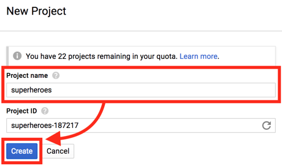

La creación del proyecto toma aproximadamente un minuto. Verás que en la barra superior, a la derecha, hay una zona de notificaciones; cuando el proyecto esté listo, recibirás el aviso correspondiente en esta zona. Una vez ocurra, seleccionamos el proyecto desde el botón que usamos anteriormente para la creación del proyecto.

La selección del proyecto nos lleva a su dashboard. Podemos aprovechar este momento para __ponernos a mano__ aquellos servicios que vamos a usar en la POC. En el menú lateral **Products & services** localizamos los servicios y hacemos clic sobre el icono de chincheta que lucen a su derecha para hacer **Pin** de ellos en la parte superior de este menú. Los servicios están localizados en las siguientes secciones: [Storage](https://console.cloud.google.com/storage) en **Storage** y [Dataprep](https://console.cloud.google.com/dataprep), [Dataflow](https://console.cloud.google.com/dataflow) y [BigQuery](https://console.cloud.google.com/bigquery) en **Big Data**.

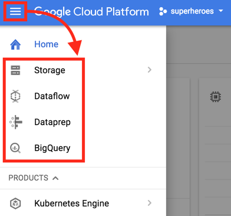

Con esto tendríamos lista la creación del proyecto. Vamos a por **Dataprep**.

## Subiendo los datos de prueba

Para esta POC vamos a usar dos datasets que contienen datos de superheroes de DC y de Marvel. Se han descargado de [este repositorio](https://github.com/fivethirtyeight/data/tree/master/comic-characters), cuyos responsables se han preocupado de obtenerlos previamente de [DC Wikia](http://dc.wikia.com/wiki/Main_Page) y [Marvel Wikia](http://marvel.wikia.com/wiki/Main_Page).

Puedes descargar los datasets desde los siguientes enlaces:

* Dataset de DC Wikia, documento [dc-wikia-data.csv](./assets/data/dc-wikia-data.csv).
* Dataset de Marvel Wikia, documento [marvel-wikia-data.csv](./assets/data/marvel-wikia-data.csv).

Seguidamente debemos subirlos a **Storage**, ya que **Dataprep** se apoya en este servicio para hacer la analítica y los procesos de transformación que procedan. Podríamos hacerlo nosotros creando un nuevo bucket en **Storage** y subiéndolos ahí, pero **Dataprep** ya lo hace automáticamente (crear un nuevo bucket) cuando se inicia por primera vez, así que le delegaremos esta tarea.

**Dataprep** es una herramienta que Google ofrece en colaboración con [Trifacta](https://www.trifacta.com/), y por tanto es nececesario permitir a éstos el acceso a los datos del proyecto. En **Dataprep** se nos muestra un diálogo que informa de esto y que debemos aceptar pulsando el botón **Allow**; una vez hecho, ya no se mostrará más este mensaje.

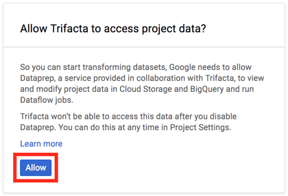

Un par de minutos más tarde, una vez se haya completado la autorización de acceso a Trifacta, se nos redirige a **Dataprep**. En este primer acceso debemos seleccionar el bucket de **Storage** sobre el cuál **Dataprep** trabajará por defecto. De hecho, tal y como se ha comentado más arriba, **Dataprep** ya ha creado un bucket por nosotros, así que nos limitamos a usarlo.

Lo siguiente que haremos será crear los datasets a partir de los documentos CSV de Wikia que descargamos hace unos minutos. Para ello, nos dirigimos a la sección **Datasets** desde el botón situado en la barra superior.

Hacemos clic en el botón **Import Data**.

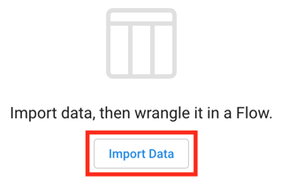

En la página de importación se nos ofrecen tres opciones: podemos importar datos desde uno o varios documentos subidos desde nuestro equipo, seleccionados desde **Storage** o bien procedentes de una tabla de **BigQuery**. Nos decidimos por la primera opción, que es la que cubre nuestro caso, y clicamos el botón **Choose a file**. Seleccionamos los documentos CSV y aceptamos; **Dataprep** los subirá a la carpeta **upload** del bucket de **Storage**.

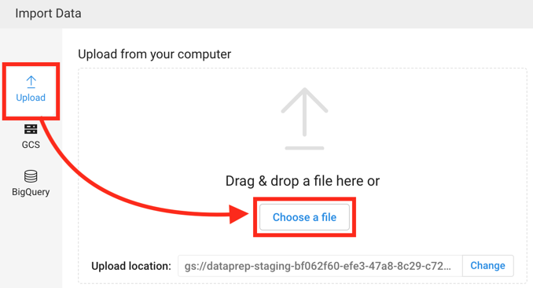

Una vez subidos los documentos, **Dataprep** dispone una previsualización de los datos que contienen en la zona derecha. Verificamos que todo esté correcto y hacemos clic en el botón **Import Datasets**.

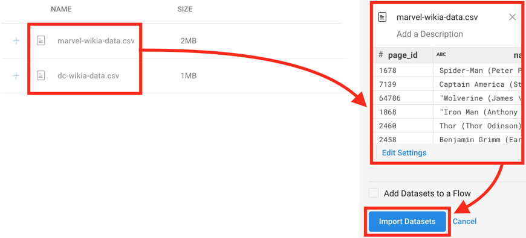

Se nos devuelve a la sección de **Datasets** donde ya aparecen listados los datasets recién importados. Con esto damos por finalizada la subida de los CSV a **Storage** y estamos listos para empezar desarrollar el proceso de ETL.

## Trabajando el ETL

Para definir un pipeline de transformaciones en **Dataprep** necesitamos acceder a la sección **Flows** y crear un nuevo flujo de trabjo desde el botón **Create Flow**.

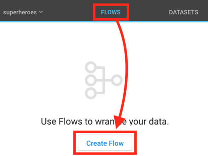

Le damos un nombre al flujo y continuamos.

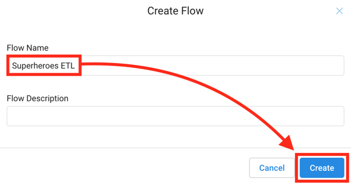

Lo primero que haremos será añadir los datasets que [subiendo en el paso anterior](#subiendo-los-datos-de-prueba) al flujo que acabamos de crear. Para ello hacemos clic sobre el botón **Add Datasets** que aparece en el centro de la pantalla.

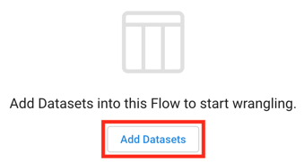

En la ventana modal que aparece, filtramos la colección de datasets por **Imported** y seleccionamos los que andamos buscando; para esta POC recordemos que estos datasets son los correspondientes a los documentos **dc-wikia-data.csv** y **marvel-wikia-data.csv**. Por último, confirmamos la selección con el botón **Add**.

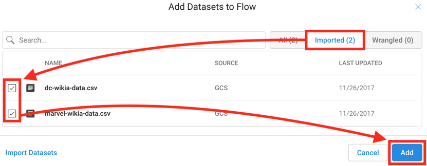

La selección de los datasets nos lleva de vuelta a la pantalla principal del flujo. Es en este punto cuando entra en juego el concepto de **recetas**: con ellas _cocinamos_ los datos, es decir, aplicamos las transformaciones que procedan en cada momento. Y como en las recetas culinarias, estas también tienen pasos.

### Uniendo los datasets

Vamos, pues, a hacer una nueva receta con nuestros datasets. ¿En qué va a consistir? Pues muy sencillo: vamos a unir los datos de ambos datasets para trabajar lo antes posible sobre un solo conjunto de datos, que es una buena práctica.

Seleccionamos uno de los dos datasets, por ejemplo **dc-wikia-data.csv**. En la zona derecha vemos que aparece un panel titulado **Details** que muestra -oh, sorpresa- los datalles de aquello que está seleccionado. Vemos también el botón **Add new Recipe**: lo pulsamos.

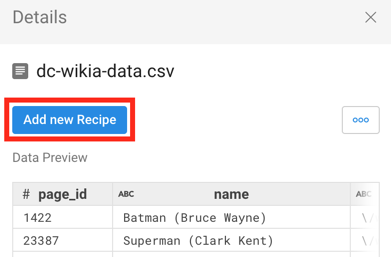

Si nos fijamos en el dataset **dc-wikia-data.csv** apreciaremos que la receta se ha añadido correctamente generando, además, un nuevo dataset. Es importante comprender esto, ya que será una constante en el uso de **Dataprep**: cada receta de transformaciones aplicada sobre un dataset genera uno nuevo como resultado de su aplicación.

La receta no tiene aún pasos definidos, así que vamos a ponerle remedio. La seleccionamos y hacemos clic en el botón **Edit Recipe** de su panel de **Details**.

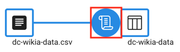

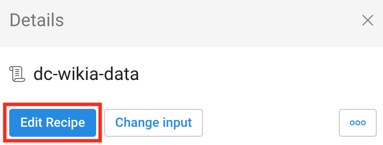

La vista de receta es muy llamativa. Por un lado, muestra una pre visualización de los datos actuales del dataset; conforme se vayan añadiendo pasos a la receta, esta pre visualización se irá actualizando. La cabecera de cada columna muestra el tipo de dato que **Dataprep** ha inferido de los valores contenidos en dicha columna; desde la propia cabecera puede cambiarse en caso de no ser el correcto. También se muestra de manera gráfica la distribución de los datos de cada columna; podemos solicitar a **Dataprep** que nos sugiera posibles acciones -transformaciones- basadas en estas distribuciones.

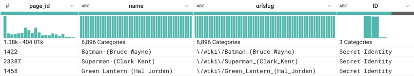

Pulsamos sobre el botón **Receipe**, situado en la barra de herramientas superior de la derecha, para mostrar el panel de pasos. Seguidamente, añadimos un paso con el botón **Add New Step**.

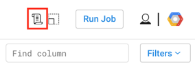

En la caja de transformaciones, buscamos por **union** y seleccionamos aquella que aparece. Esta transformación añade las filas de dos o varios datasets en uno nuevo, que es justo lo que vamos buscando.

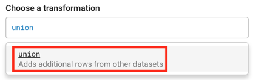

La pantalla de edición de la transformación **Union** aparece con el estado actual; debemos añadir el otro dataset que habíamos seleccionado en el flujo, pues por defecto solo aparece aquel sobre el cuál estamos aplicando la transformación. Lo haremos desde el botón **Add datasets**.

En la ventana modal que aparece seleccionamos el dataset **marvel-wikia-data.csv** y aceptamos con el botón **Add Datasets and Align by Name**.

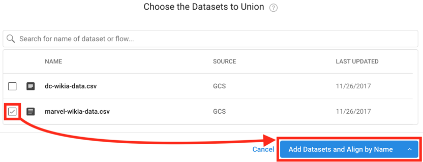

Ahora sí, la edición de la transformación **Union** parece correcta. Puesto que ambos datasets contienen las mismas columnas, esta unión es directa y no requiere ninguna otra manipulación.

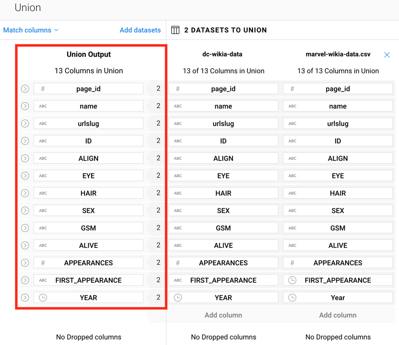

De nuevo en la vista de la receta, podemos confirmar cómo la transformación **Union** se muestra como el primer -y único- paso de la misma.

Damos por buena la receta y volvemos a la vista del flujo. Para ello hacemos clic sobre el su nombre, el del flujo, en la parte superior izquierda de la pantalla.

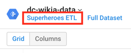

En esta vista del flujo vemos cómo se ha representado gráficamente la transformación **Union** entre los datasets: supone una gran ayuda visual, ya que de un vistazo podemos interpretar sin lugar a dudas lo que ocurre en esa receta.

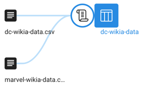

Este primer paso del ETL termina. Vamos con el siguiente.

### Normalizando los datos

Esta segunda receta que vamos a crear irá destinada a la normalización de los datos. Podríamos dividir las transformaciones en distintas recetas, pero son lo suficientemente sencillas como para hacerlas como pasos de una misma receta.

Aprovechando que ya sabemos cómo trabajar con recetas, vamos a crear una nueva para _cocinar_ los datos del dataset resultante del [paso anterior](#uniendo-los-datasets). Una vez creada, la editamos y añadimos los siguientes pasos.

#### Eliminando columnas innecesarias

Vamos a eliminar del dataset aquellas columnas que no aporten valor alguno en esta POC. Esto se hace aplicando la transformación **drop** en el panel **Recipe** de la vista de receta. Las columnas que debemos seleccionar son las siguientes:

* page_id
* urlslug
* GSM
* FIRST_APPEARANCE

Este primer paso de la receta debería tener un aspecto similar al siguiente:

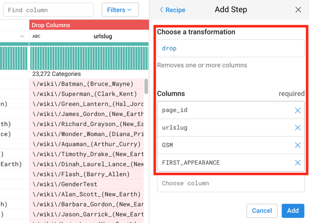

Vamos a por los siguientes.

#### Normalizando la columna ALIVE

Los pasos que continuan la receta están destinados a poner orden en la columna **ALIVE**. Esta columna muestra qué superheroes del dataset están vivos y qué superheroes no lo están, pero en vez de hacerlo con un tipo de dato **booleano** lo hace con un tipo **string**. Lo que haremos será cambiar el tipo de dato de esta columna para trabajar más cómodamente con los datos que conteniene. Añadiremos los siguientes pasos:

* Transformación **replace** para cambiar el valor **Living Characters** de la columna **ALIVE** por **True**.

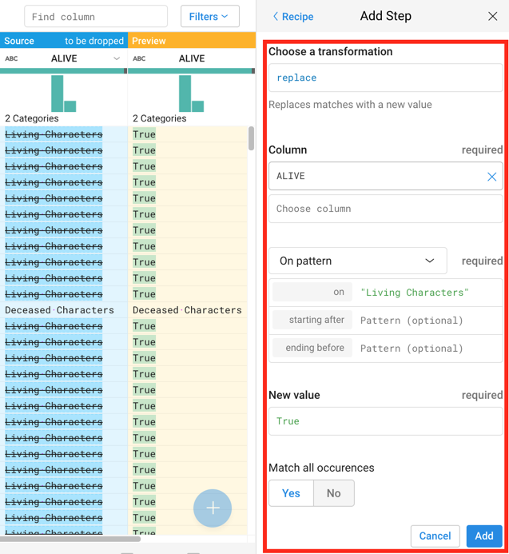

* Transformación **replace** para cambiar el valor **Deceased Characters** de la columna **ALIVE** por **False**.

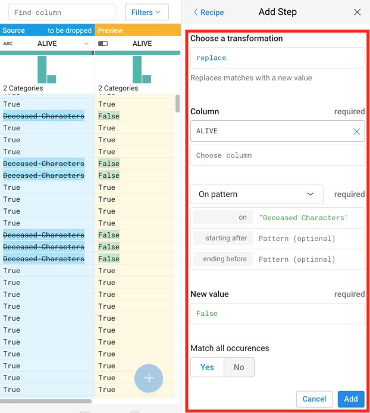

* Transformación **settype** para cambiar el tipo de dato de la columna a **Bool**. Podemos añadir, como hasta ahora, la transformación de manera manual, pero podemos aprovechar para hacerlo desde la cabecera de la columna y así practicar esta funcionalidad.

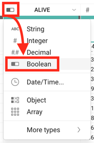

Llegados a este punto, deberíamos tener los siguientes pasos en la receta.

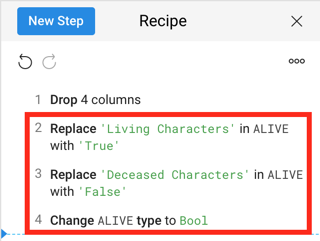

Continuamos, que ya queda poco.

#### Normalizando la columna APPEARANCES

La columna **APPEARANCES** muestra el número de veces que un superheroes hace acto de presencia en los cómics. El problema es que, en caso de no haber aparecido aún en ninguno, el valor en la columna aparece como una cadena vacía, cuando lo ideal es que fuese el número **0**. Podemos arreglarlo rápidamente con la transformación **replace**.

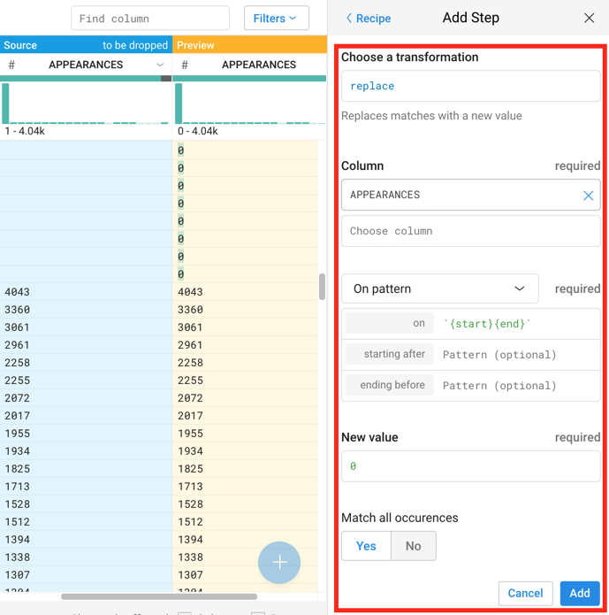

Y ya que estamos, nos asguramos de que el tipo de la columna sea **Integer**.

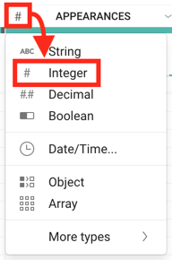

La receta debe tener este aspecto.

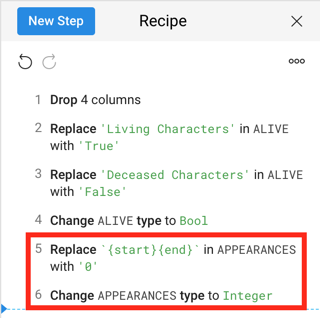

Ahora sí, los datos están tal y como los necesitamos para esta POC. Podemos proceder ya con la exportación.

### Exportando los datos

Los datos van a exportarse a una tabla de **BigQuery**. Antes de ponernos con ello, debemos preparar este servicio creando un nuevo dataset. En **BigQuery**, las tablas se almacenan en datasets y actualmente no tenemos ninguno disponible; de ahí la necesidad de esta primera parada en la exportación.

#### Preparando BigQuery

Vamos a **BigQuery** y desplegamos el menú contextual de opciones del proyecto **superheroes** para crear un nuevo dataset; la opción que hace la magia es **Create new dataset**.

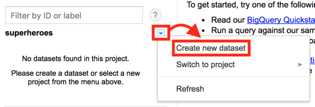

En la ventana modal que aparece, indicamos un nombre para el dataset y aceptamos.

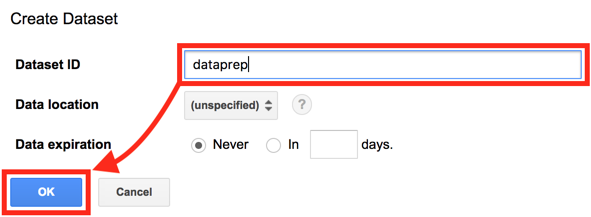

El dataset se crea en un instante y aparece bajo el proyecto, en la zona izquierda de la interfaz. Esto debería ser suficiente para hacer la exportación de los datos de superheroes desde **Dataprep**, pero por alguna razón desconocida -suponemos que por estar aún en fase beta- nos toca hacer un paso más.

**Dataprep** no es capaz de escribir una nueva tabla sobre un dataset vacío, así que vamos a crear una tabla _dummy_ -señor hack- para evitar este problema. En **BigQuery**, junto al nombre del dataset que hemos creado hace un momento, aparece un pequeño botón con el signo **+** que facilita la creación de nuevas tablas.

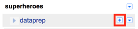

Lo pulsamos y creamos una tabla con la siguiente configuración.

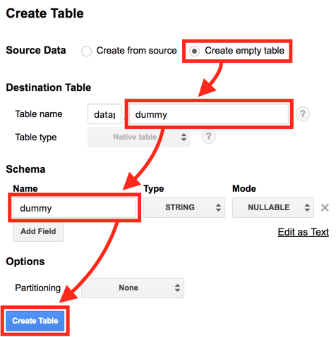

Ahora sí, ya podemos proceder con la exportación desde **Dataprep**.

#### Creando el job de exportación

Volviendo a **Dataprep**, echamos un ojo a nuestro flujo. Editamos los nombres de los datasets y elegimos unos más acordes a los datos que contienen. Deberíamos tener un flujo similar al siguiente.

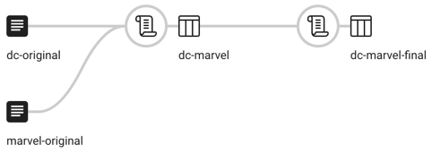

Es hora de preparar el job de exportación del dataset **dc-marvel-final**. Para hacerlo, lo seleccionamos y hacemos clic sobre el botón **Run Job** que aparece en el panel de detalles del dataset, en la zona derecha.

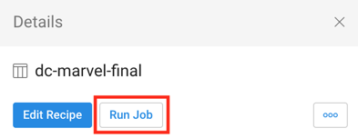

Por defecto, **Dataprep** viene configurado para hacer la publicación -exportación- de los datos en **Storage**, pero nosotros vamos a cambiarlo para que lo haga en **BigQuery**. En la vista **Run Job on Dataflow**, eliminamos la publicación que aparece y creamos una nueva desde el botón **Add Publishing Action**.

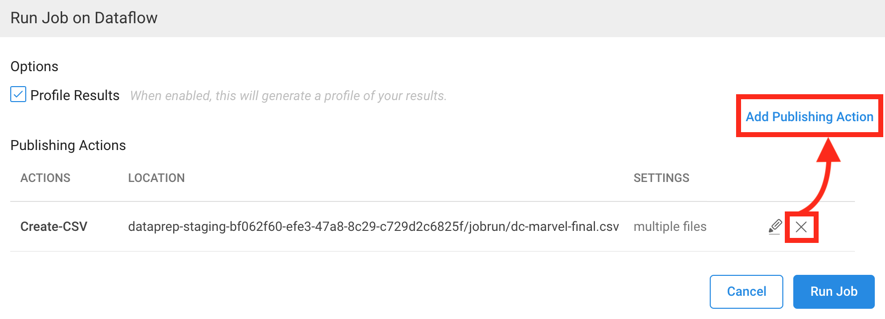

Configuramos la **Publishing Action** seleccionamos el dataset de **BigQuery** que creamos [más arriba](#preparando-bigquery). Seguidamente, indicamos que queremos crear una nueva tabla para la publicación haciendo clic en el botón **Create a new table**.

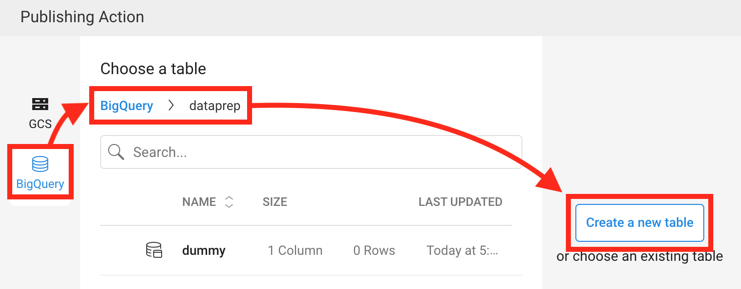

Revisamos el nombre de la tabla e indicamos a **Dataprep** que cada publicación del dataset debe crear una nueva. Es importante evaluar las opciones ofrecidas para ver cuál de ellas se ajusta más a cada caso; para esta POC, replicar datos en distintas tablas es la opción más acertada, ya que podemos comparar publicaciones en caso de modificar el ETL de los datos. Guardamos la configuración con el botón **Save Settings**.

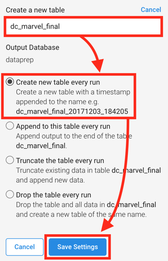

De nuevo en la vista **Run Job on Dataflow**, verificamos que la publicación sea la correcta y pulsamos el botón **Run Job**.

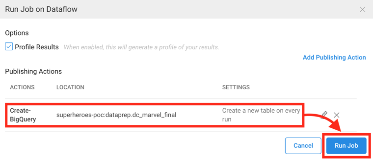

Se nos lleva a la sección de **Jobs** donde podemos ver el estado de la publicación que acabamos de lanzar.

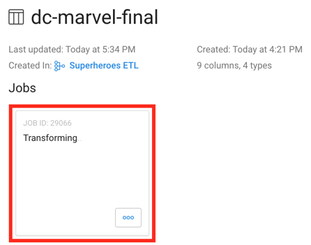

El servicio encargado de ejecutar el flujo de transformaciones definido sobre los conjuntos de datos es **Dataflow**. Podemos dirigirnos a este a este servicio para ver en tiempo real cómo se van ejecutando las transformaciones desde el menú contextual del job, en la opción **Cloud Dataflow Job**.

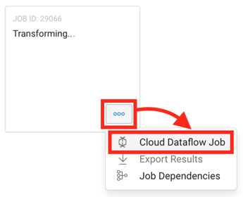

**Dataflow** muestra mucha información de valor relacionada con el job que está ejecutando. Por ejemplo, podemos ver el grafo del plan de ejecución de las transformaciones.

También, un resumen con los principales datos del job.

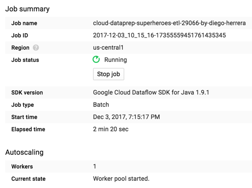

Métricas de los recursos de hardware que **Dataflow** ha aprovisionado para la ejecución del job.

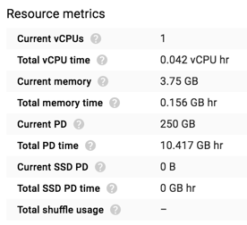

O el socorrido y siempre útil log de acciones.

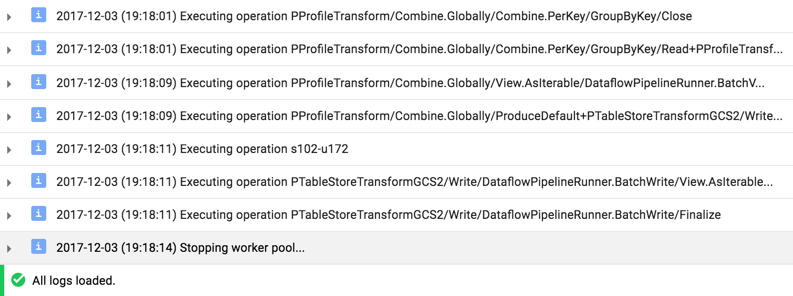

Una vez el job ha terminado, podemos consultar los resultados detallados de la aplicación de las transformaciones. Para ello, hacemos clic sobre el botón **View Results** del job.

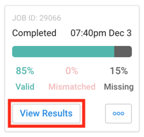

Se nos muestran los resultados.

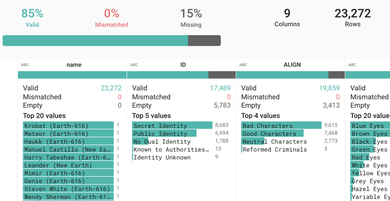

Hasta aquí la ejecución del job. Podemos ir a **BigQuery** para verificar que los datos se han escrito correctamente en la tabla que indicamos.

## Visualizando el resultado

Una vez que tenemos los datos ya _cocinados_ en BigQuery, vamos a visualizarlos con [Data Studio](https://datastudio.google.com/), una herramienta para crear cuadros de mando e informes interactivos de Google.

Nos dirigimos al site de la herramienta y hacemos clic en el botón **Start a new report** de tipo **blank**, en el centro de la pantalla.

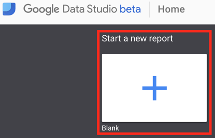

Esto creará un nuevo informe en blanco. Seguidamente, el navegador nos lleva a la edición del informe, donde lo primero que haremos será darle un nombre _decente_ haciendo clic sobre el texto que aparece por defecto.

Lo siguiente que haremos será elegir el origen de los datos. **Data Studio** ofrece algunas muestras de ejemplo para _jugar_ con ellas, pero nos iremos directos a seleccionar la tabla de **BigQuery** donde exportamos los datos de superheroes de la POC.

En el panel lateral derecho, donde se muestran los datasets de prueba, aparece también un botón titulado **Create new data source**. Lo pulsamos.

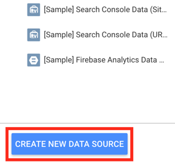

Se nos lleva a la vista de creación de orígenes de datos. Le damos un título acorde a la situación y seleccionamos secuancialemente el conector **BigQuery**, el proyecto GCP sobre el que hemos estado trabajando, el dataset **dataprep** y la tabla **dc_marvel_final**. Si alguno de esos datos no se corresponde con los tuyos, elige los que apliquen. Para finalizar, pulsamos el botón **Connect**.

**Data Studio** es capaz de interpretar automáticamente el tipo de los datos que hemos conectado. Lo muestra en una tabla similar a la siguiente, donde podemos tanto cambiar los tipos de datos mal detectados como establecer funciones de agregación en aquellas columnas que lo permitan. Cuando lo tengamos listo, añadimos el origen de datos al informe desde el botón **Add to report**.

Y confirmamos en el diálogo modal.

Vamos a añadir una gráfica para familiarizarnos con la interfaz de **Data Studio**. Esta gráfica va a mostrar cómo está distribuido el género de los personajes que figuran en el dataset.

En la barra de herramientas superior tenemos diversas opciones de gráficas: vamos a elegir una **Pie chart**, que es el _gráfico de tarta_ clásico.

Cuando la seleccionemos, debemos elegir el tamaño y posición que ocupará dentro del informe. Lo haremos con el ratón, manteniendo pulsado el botón izquierdo mientras se arrastra. Una vez dibujada la gráfica, en la zona derecha se habilitará un panel de propiedades; desde aquí podremos configurar tanto los datos que mostrará la gráfica como el aspecto estético de la misma.

En la pestaña **Data**, marcamosla columna **SEX** como **Dimension** y ordenamos los resultados de manera ascendente también por **SEX**.

La gráfica se habrá actualizado con los datos de género. Si nos fijamos bien, hay un género que aparece vacío, sin nombre: representa el sumatorio de aquellos géneros que son nulos -cadena vacía, concretamente-. Si queremos evitar que aparezcan en la gráfica, debemos filtrar el dataset.

Desde el panel de propiedades de la gráfica, en la pestaña **Data**, pulsamos el botón **Add a filter**.

Se nos despliega el panel de edición de filtro en la parte inferior. Indicamos un nombre y añadimos un filtro que excluya las filas cuya celda **SEX** esté vacía. Esto podemos hacerlo fácilmente con la expresión regular **/$^/**. En **Data Studio** no es necesario indicar las **/** en las regex.

Es el momento de jugar con la estética de la gráfica. En el panel de propiedades, vamos a la pestaña **Style** y hacemos lo siguiente: establecemos un solo color para resaltar las distintas zonas de la gráfica, y hacemos un _donut_ con ella aumentando el tamaño del agujero central desde el slide habilitado para ello.

Deberíamos tener algo parecido a lo siguiente:

Tal y como hemos hecho con esta gráfica, podemos probar otras de las que se ofrecen cambiando los datos que representan, los filtros, agregaciones, estilos, etc.

Cuando se haya finalizado la edición del informe, podemos pasar al modo vista desde el botón **View**, situado en la parte superior derecha de la interfaz.

Así podemos ver en cualquier momento la forma que va tomando el informe.

